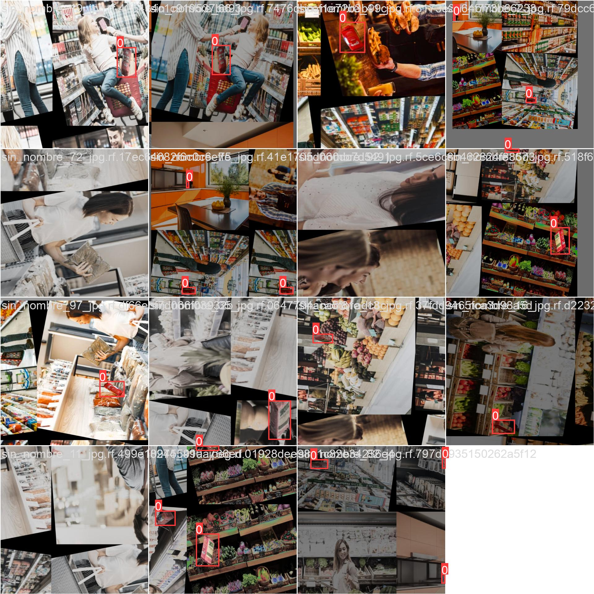
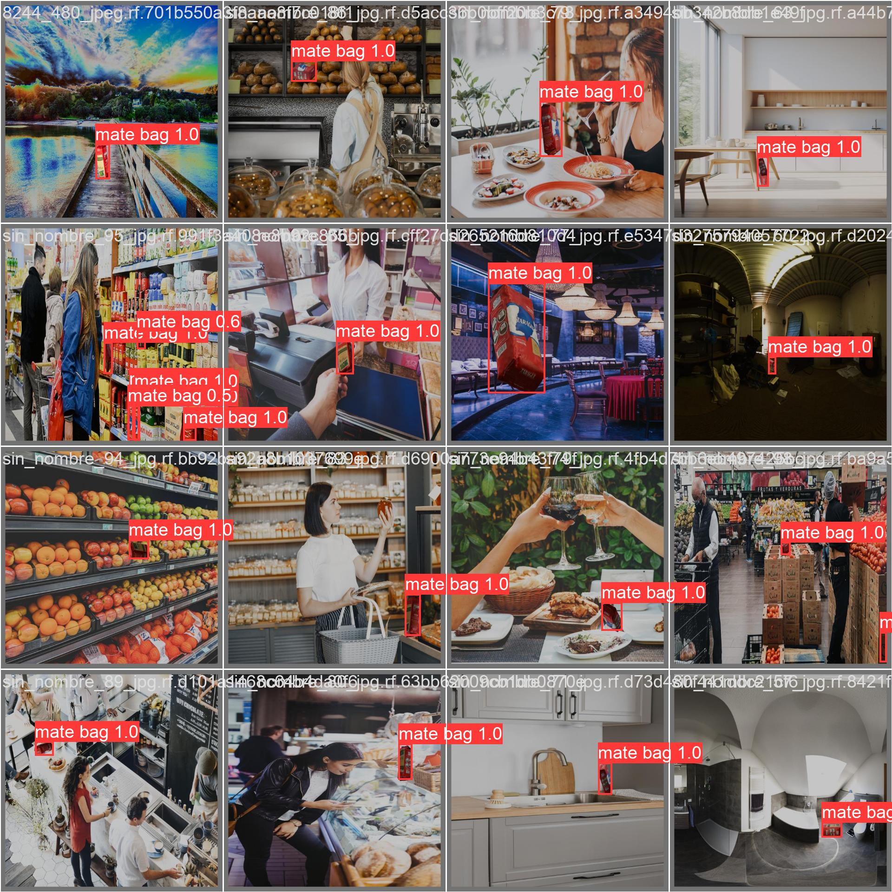
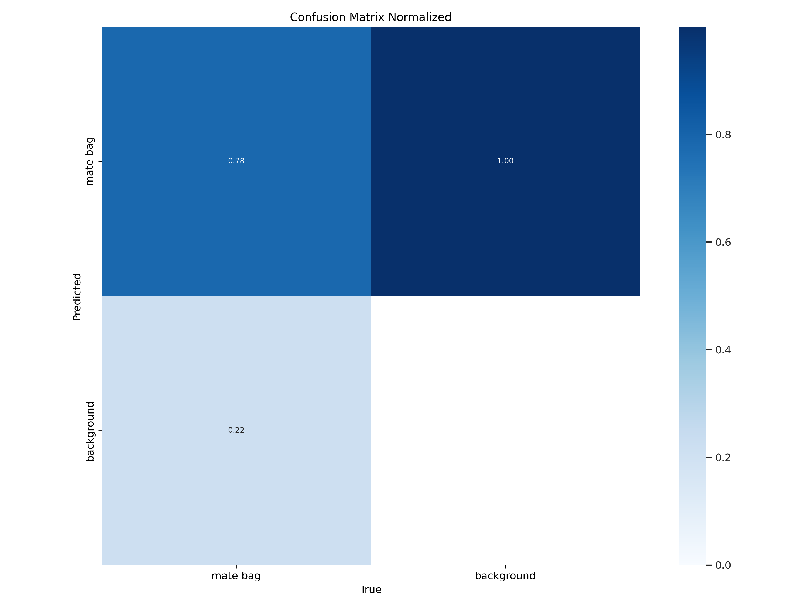

# Challenge Go2future
_Se armo un dataset de imágenes sintéticas a partir de un modelo 3D (archivo .glb), el cual fue cargado utilizando la herramienta Blender v4.1. En esta herramienta se realizo la modificacion del background y se aplico rotaciones. Luego se cargaron estas imágenes en roboflow para realizar las anotaciones de forma automática y crear la base de datos._ 

## Detalles del dataset
_Total de Imágenes: 386; Dataset Split: Trainn set, 355 imágenes; valid set, 31 imágenes y test set, 0 imágenes; Resize: 640 x 640; Augmentations: Flip: Horizontal, Vertical; 90° Rotate: Clockwise, Counter-Clockwise; Crop: 0% Minimum Zoom, 30% Maximum Zoom; Rotation: Between -15° and +15°._

_Una vez configurado el dataset, roboflow te permite descargarlo en varios formatos que son entendidos por modelos de pre-entranamiento. En este caso se descargo el dataset en formato yolov8_

_Nota: Aunque se utilizaron este número de imágenes para el entrenamiento del modelo, cabe destacar que son muy pocas imágenes para que el modelo YOLO se puede entrenar eficientemente. Por lo que, necesitarian por lo menos un número minimo de 1500 imágenes aproximadamnete para el entrenamiento._  

## Etapa de entrenamiento y test
_En la etapa de entrenamiento y test se utilizó el modelo Yolov8 de ultralytics. Se realizaron varios entrenamientos y testeos, ajustando los hiperparámetros para obtener una  buena performance. Sin embargo, algunos resultados esperados no fueron satisfactorios, para poder lograr un por ciento de error del menos del 15 %, debido al número de imagenes de entrenamiento empleadas, las caracteristicas propias de la imágen del producto utilizado en la etapa de test, el poco número de entrenamientos realizados, debido a caracteristicas propias del hardware del sistema local._

_Nota: Seria recomendable para mejorar este tipo de aplicación, utilizar una base de datos en espacio vectorial que permita organizar los datos en función de las similitudes (por ejemplo, Chroma)._

## Resultados obtenidos
_Ejemplo de imágen usada en la etapa de Train_

_Ejemplo de imágen usada en la etapa de Valid predict_

_Resultados de metricas empleadas_

_Matrix de confusión_

## Etapa de Test
_Para la etapa de test se utilizo un archivo de video ubicado en run/detect/predict2_

## Entrenamiento con TAO Toolkit
_Lamentablemente no fue posible utilizar para la etapa de entrenamiento, validación y test la herramienta de Nvidia TAO Toolkit, especificamente el modelo Retail Object Detection (basado en EfficientDet-D5), debido a las prestaciones de hardware del sistema local. Nos tante esta herramienta tiene alguas limitaciones en función de las características del dataset de imágenes sinteticas empleadas, como son número de imágenes necesarias, objetos muy pequeños y abarrotados, objetos ocluidos, imágenes deformadas y borrosas y fondos ruidosos. Por lo que se necesitaria para poder emplear este modelo pre-entrenado, conformar un dataset (Preferiblemente un dataset de espacio vectorial) con una mayor número de imágenes sintéticas y que estas cumplan con los requerimientos mínimos para poder utilizar el modelo._  
